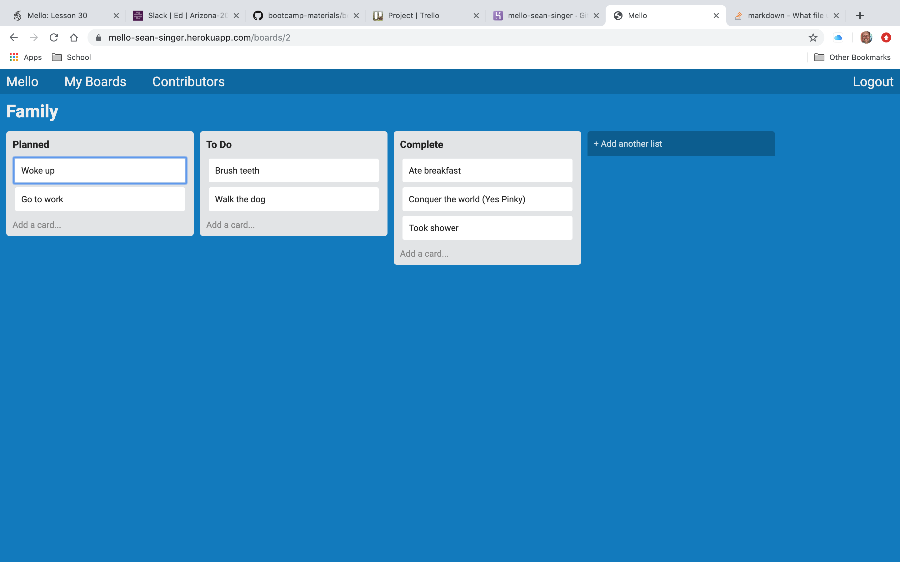

# Mello Rails API  App

I built this Trello clone app to practice creating a javascript heavy rails ap using an API.  It was great practice, and I learned a lot especially about Javascript.  You can see it also does a pretty good job mimicing the official Trello app.

[Link to Mello](https://mello-sean-singer.herokuapp.com/)
